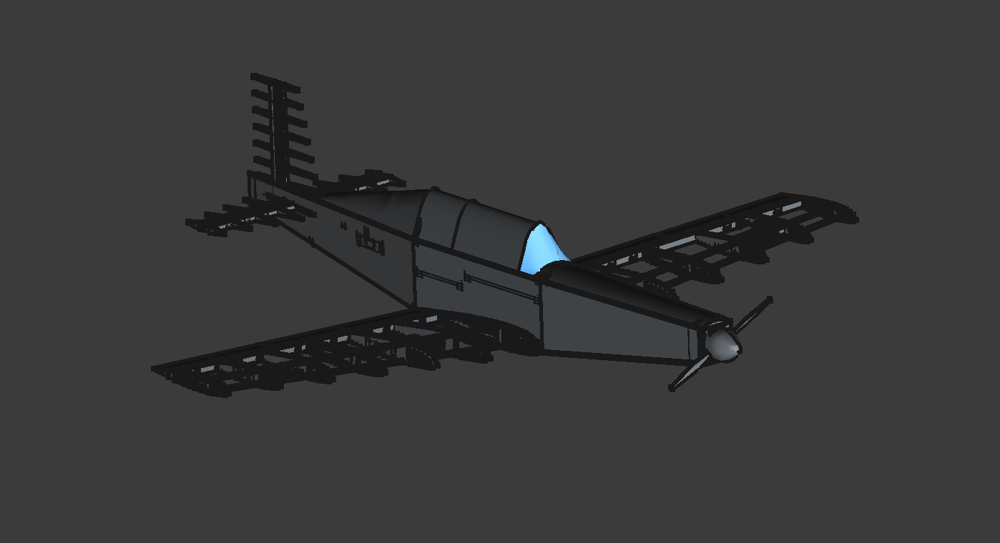
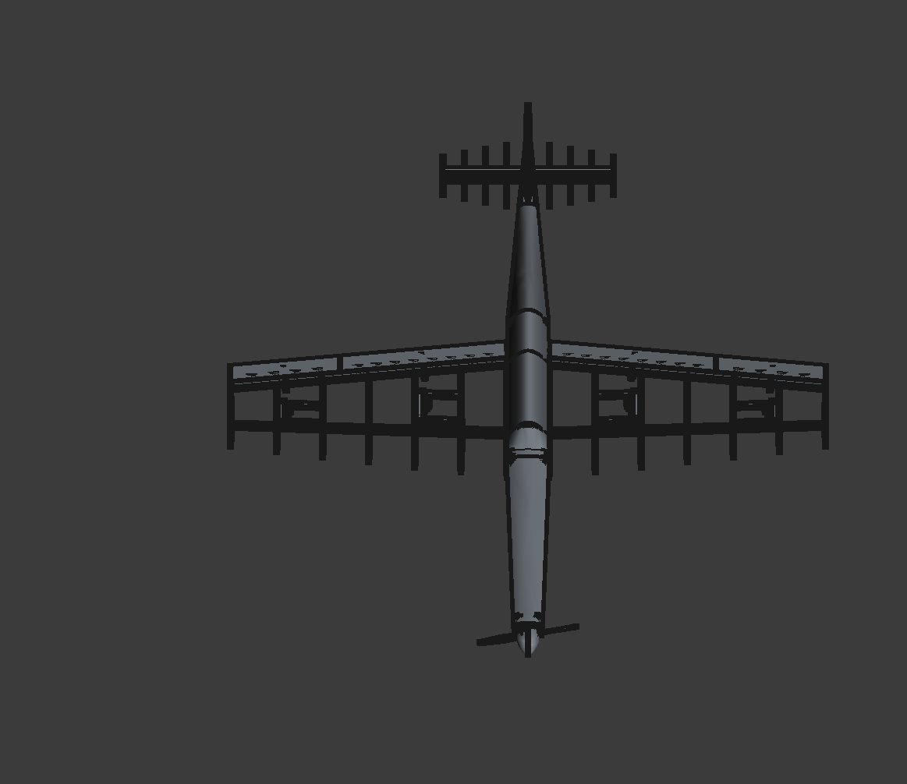
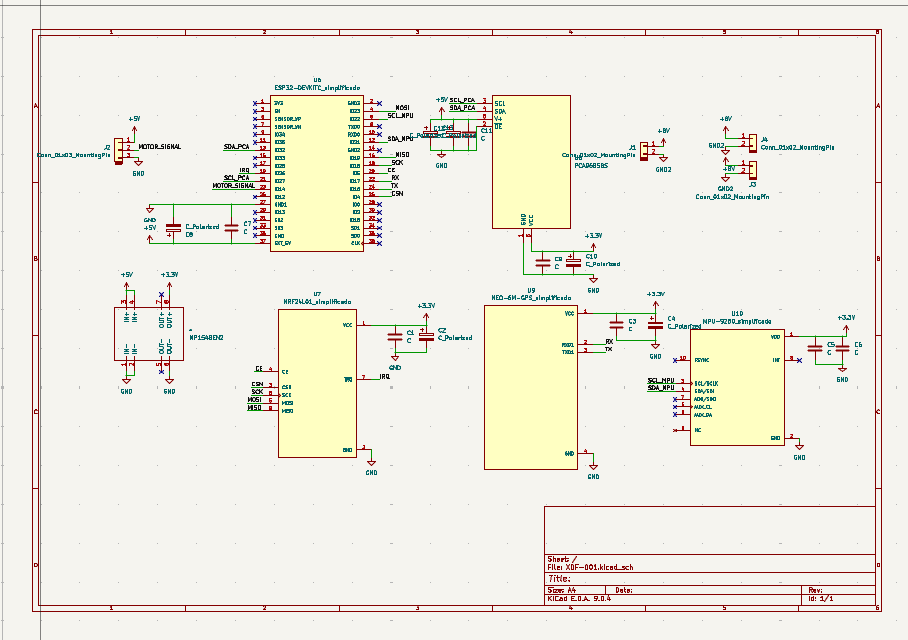
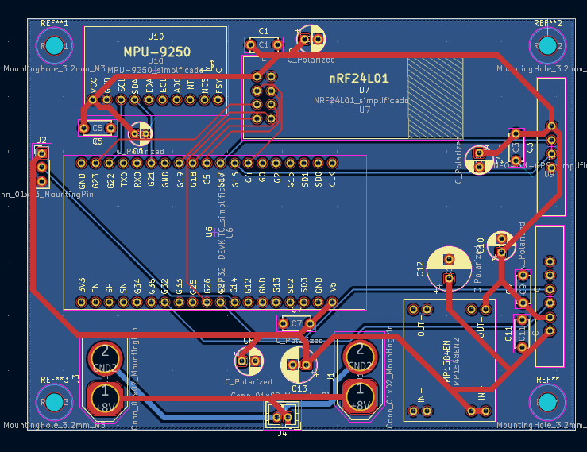
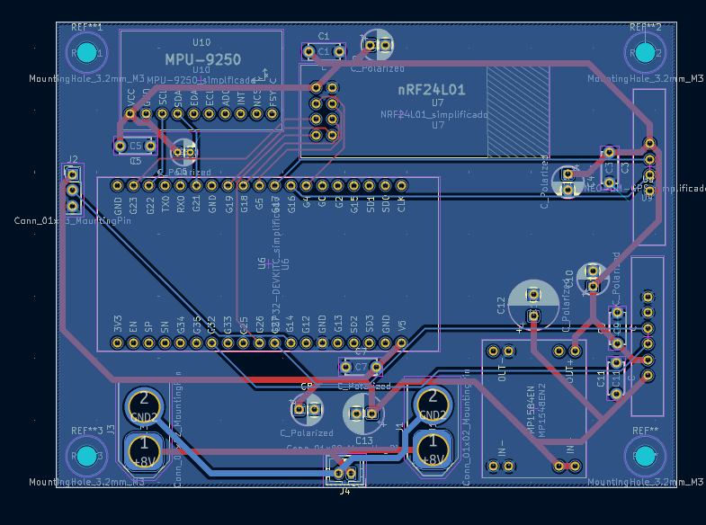
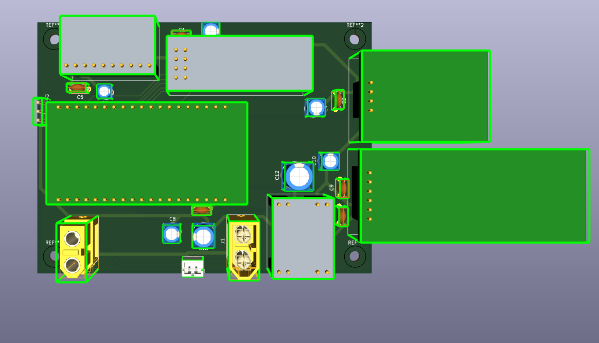
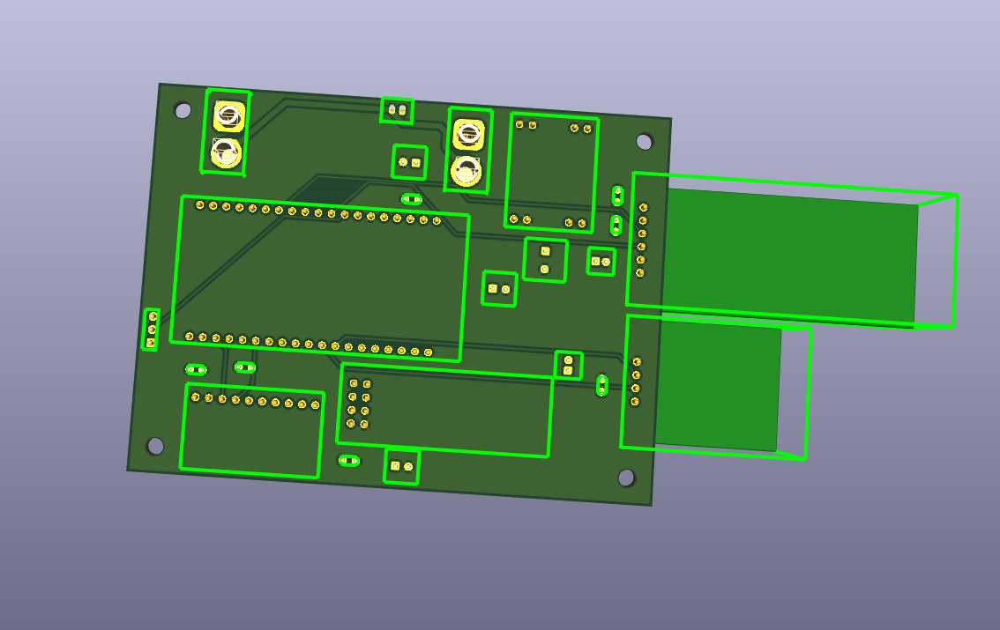
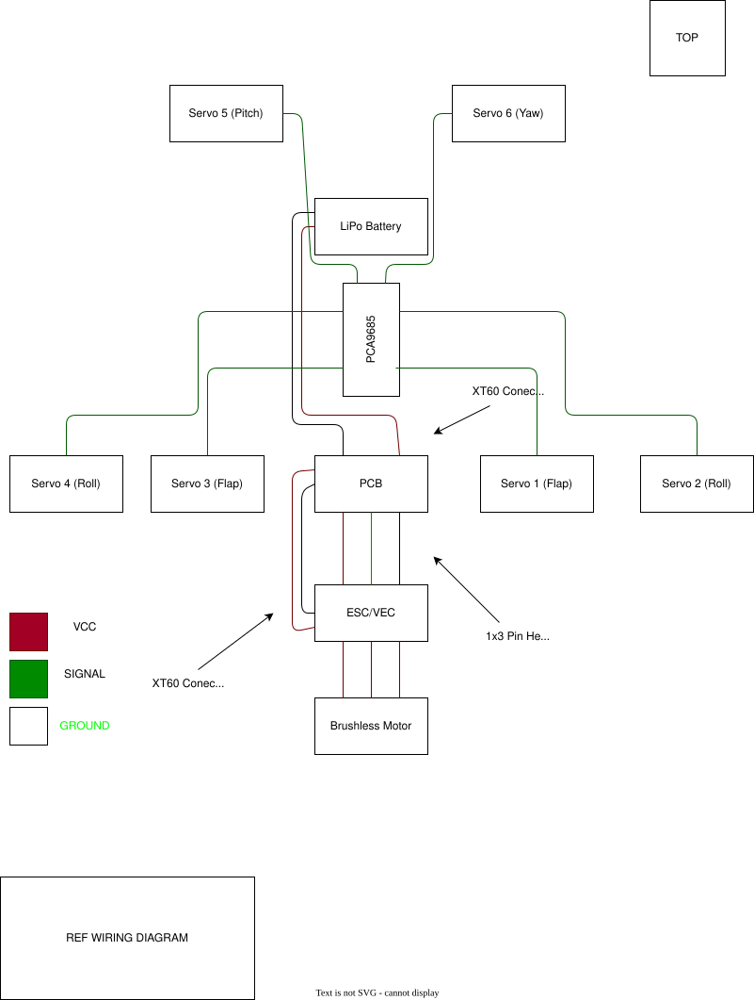

# XDF-001

## Introduction

### What is XDF-001?

The **XDF-001**, or **Experimental Drone Fighter Model 001**, is a flight platform based on the P-51 Mustang airframe. Its experimental objective is to achieve a multi-role aircraft capable of both aerobatic flight and payload transport. Additionally, the XDF-001 platform seeks to demonstrate the viability of implementing simple autonomous capabilities in RC drones using vector operations, alongside data visualization via the **XDF-001 Control** application.

### Motivation

The motivation for this project stems from an interest in military aviation and aeronautics, as well as addressing the economic barriers within the RC aircraft community. Developing an aircraft within the ESP32 ecosystem helps overcome financial constraints, enabling the transition beyond typical 8-inch drones to larger-scale aircraft at equally competitive prices.

Another key motivation is the code's iterative potential; it can be adapted and modified for a myriad of missions and other types of aircraft and vehicles, allowing for extensive iteration and versatility.

### Objectives

The primary objective is to develop a fixed-wing platform based on the ESP32 ecosystem, capable of both radio control and simple autonomous maneuvers such as waypoint navigation or orbiting.

The secondary objectives are:

- Development of a telemetry visualization and control application for the flight platform.
- Study of various aerodynamic configurations to maximize the stability-to-top-speed ratio.
- Study of ESP32 behavior in handling real-time vector operations and autonomous capabilities.
- Development of a payload bay within the platform for payload transport.

### Architecture

As previously mentioned, the project is based on the ESP32 ecosystem and programmed using the Arduino IDE. However, communication between the ground ESP32 and the PC utilizes a binary system, enabling both command transmission and telemetry reception via USB serial. For a comprehensive study of the firmware architecture, please refer to the **[Documentation](Documentation/)** folder: check the diagrams section for data flows or the PDF section for function documentation.

## Project Parts

Below is a brief description of the repository's main folders and their contents:

### [CAD](CAD/)

Contains all CAD modeling files, including the root file modeled in FreeCAD and `.stp` files for the aircraft and PCB, as well as 3D models for the modules used.

### [Firmware](Firmware/)

Contains all ESP32 code, divided into air and ground sections. This includes communication functions, vector calculations, etc.

### [PCB](PCB/)

Contains all electronics-related files, including schematics, `.pcb` files, and manufacturing Gerbers.

PCB Schematic

PCB Front layer

PCB Back Layer

PCB Top view

PCB Bottom view

Referencial Wiring Diagram of the aircraft

### [XDF-001 Control](XDF-001_Control/)

Dedicated strictly to the visualization and control application. Contains all backend and frontend code.

### [References](References/)

Contains all structural references and concepts adopted from various creators for the project's construction.

### [Documentation](Documentation/)

Contains flowcharts and a detailed PDF explaining the application code, autonomous functions, and vector-based calculations.

### [Construction Manual](Construction%20Manual/)

PDF file detailing the aircraft construction method and key considerations for assembly.

## Changelog

### V0.0.0

Base project files have been exported, including code prototypes for both the ground and air sections. This release also includes the prototype for the control and telemetry application, as well as the PCB rendering, schematics, and CAD files.

## Roadmap

### V0.1.0

Completion of integration with Excel and SQL databases for the control and telemetry application.
Theoretical completion of the ground and air section code, enabling remote flight capabilities without telemetry and video visualization.

### V0.2.0

Achievement of initial flight tests, featuring full integration between the ground section and the control and telemetry application.
Initial implementation of autonomous functions, such as navigating to a designated point at a predefined altitude.

## FAQ

### What is the cost of the project?

The cost of the project varies depending on the dimensions of the flight platform and the components selected. For instance, opting to exclude the camera or telemetry functions can result in a cost of approximately $30. Conversely, selecting premium components can increase the cost to the order of $200 or more.

### Can I adapt this project?

Yes, under the license provided, I grant permission for the project to be modified to suit individual needs. In fact, adaptability is one of the core objectives of this project.

### What types of peripherals can I use to control the drone?

Any peripheral is acceptable provided it can be read by the ESP32 microcontroller. In this instance, a console controller was used, but joysticks, keyboards, mice, or any HID device are also compatible.

### How is the visualization and telemetry application used?

#### User Mode (Run Executable)

To use the application as a final user:

**Option A: Installer (Recommended)**

1. Navigate to `XDF-001_Control/out/make/squirrel.windows/x64/`.
2. Run `xdf-001_control-1.0.0 Setup.exe`.
3. The app will install and open automatically.

**Option B: Portable (Direct Run)**

1. Navigate to `XDF-001_Control/out/xdf-001_control-win32-x64/`.
2. Run `xdf-001_control.exe` directly.
3. No installation required. (You can also share the `out/make/zip` file).

#### Developer Mode (Run from Source)

If you want to modify the code or debug:

1. **Prerequisites**: Ensure [Node.js](https://nodejs.org/) (LTS) is installed.
2. Open a terminal in `XDF-001_Control`.
3. Install dependencies: `npm install`.
4. Start the app: `npm start`.

#### Build Mode (Create Executable)

To generate the `.exe` file yourself:

1. Follow the **Developer Mode** steps to set up the environment.
2. Run the build command: `npm run make`.
3. The output files will be created in the `out/` folder.

## Bill of Materials

| Item                                                                                                          | Description                                                                                                                                                                                                                        | Quantity | Unit price | Total Price | Source                                                                                                                                                                                                                                                                                                                                                                                                                                                                                                                                                                                                                                                                                                                                                                                                                                                                                                                   | Running Total ($ with Tax) |
| ------------------------------------------------------------------------------------------------------------- | ---------------------------------------------------------------------------------------------------------------------------------------------------------------------------------------------------------------------------------- | -------- | ---------- | ----------- | ------------------------------------------------------------------------------------------------------------------------------------------------------------------------------------------------------------------------------------------------------------------------------------------------------------------------------------------------------------------------------------------------------------------------------------------------------------------------------------------------------------------------------------------------------------------------------------------------------------------------------------------------------------------------------------------------------------------------------------------------------------------------------------------------------------------------------------------------------------------------------------------------------------------------ | -------------------------- |
| ESP-32 Devkit 38 pins                                                                                         | Dev board that will allow processing of telemetry, air-to-ground communication and autonomous operations based on vector operations                                                                                                | 1        | 4,23       | 4,23        | [Aliexpress](https://es.aliexpress.com/item/1005001838731651.html?spm=a2g0o.productlist.main.18.6aefAaMDAaMDfQ&algo_pvid=d139c637-1bda-40c7-91ef-705adb1c6616&algo_exp_id=d139c637-1bda-40c7-91ef-705adb1c6616-17&pdp_ext_f=%7B"order"%3A"36"%2C"eval"%3A"1"%2C"fromPage"%3A"search"%7D&pdp_npi=6%40dis%21USD%213.34%213.34%21%21%213.34%213.34%21%4021033d9d17668726156532986ee92f%2112000030215458678%21sea%21CL%210%21ABX%211%210%21n_tag%3A-29910%3Bd%3Aeb55f528%3Bm03_new_user%3A-29895&curPageLogUid=kPFgvXo63lz3&utparam-url=scene%3Asearch%7Cquery_from%3A%7Cx_object_id%3A1005001838731651%7C_p_origin_prod%3A)                                                                                                                                                                                                                                                                                                 | 5,03                       |
| PCA9685 Servomotor Driver                                                                                     | Servomotor driver that allows control of up to 16 servomotors using only 2 pins, mainly used to avoid using all the pins of the ESP32 and for more sophisticated control via binary control                                        | 1        | 1,2        | 1,2         | [Aliexpress](https://es.aliexpress.com/item/1005010790150348.html?spm=a2g0o.detail.pcDetailTopMoreOtherSeller.3.101dnTiZnTiZhu&gps-id=pcDetailTopMoreOtherSeller&scm=1007.40050.354490.0&scm_id=1007.40050.354490.0&scm-url=1007.40050.354490.0&pvid=1402e862-8566-486e-90f8-f426f7e59b77&_t=gps-id:pcDetailTopMoreOtherSeller,scm-url:1007.40050.354490.0,pvid:1402e862-8566-486e-90f8-f426f7e59b77,tpp_buckets:668%232846%238116%232002&pdp_ext_f=%7B"order"%3A"7"%2C"spu_best_type"%3A"price"%2C"eval"%3A"1"%2C"sceneId"%3A"30050"%2C"fromPage"%3A"recommend"%7D&pdp_npi=6%40dis%21USD%218.09%211.20%21%21%2155.58%218.25%21%402101e07217707498748102094ee684%2112000053516946348%21rec%21CL%21%21ABX%211%210%21n_tag%3A-29910%3Bd%3Aeb55f528%3Bm03_new_user%3A-29895%3BpisId%3A5000000197836568&utparam-url=scene%3ApcDetailTopMoreOtherSeller%7Cquery_from%3A%7Cx_object_id%3A1005010790150348%7C_p_origin_prod%3A) | 1,43                       |
| nRF24l01+PLA Module                                                                                           | Radio module that allows medium-range air-to-ground communication without major interference; a PLA antenna is added to maximize range.                                                                                            | 2        | 2,31       | 4,62        | [Aliexpress](https://es.aliexpress.com/item/1005005392489486.html?spm=a2g0o.productlist.main.61.6d5a7b36oTXVMC&utparam-url=scene%3Asearch%7Cquery_from%3Apc_back_same_best%7Cx_object_id%3A1005005392489486%7C_p_origin_prod%3A&algo_pvid=2a2ddc30-49a7-491e-a55d-5e63838ab23c&algo_exp_id=2a2ddc30-49a7-491e-a55d-5e63838ab23c&pdp_ext_f=%7B"order"%3A"6"%2C"fromPage"%3A"search"%7D&pdp_npi=6%40dis%21USD%212.11%212.11%21%21%212.11%212.11%21%402103274e17668729080428683e0e67%2112000032873703259%21sea%21CL%210%21ABX%211%210%21n_tag%3A-29910%3Bd%3Aeb55f528%3Bm03_new_user%3A-29895)                                                                                                                                                                                                                                                                                                                              | 5,5                        |
| NEO6M GPS Module                                                                                              | GPS module that allows knowing the exact position of the aircraft along with its speed and altitude, key for both vector calculation and telemetry                                                                                 | 1        | 2,33       | 2,33        | [Aliexpress](https://es.aliexpress.com/item/1005009301460295.html?spm=a2g0o.productlist.main.2.6e7b546aTtN7q9&algo_pvid=cd9f6df0-bdd4-4e11-b4e6-43887aaf22cf&algo_exp_id=cd9f6df0-bdd4-4e11-b4e6-43887aaf22cf-1&pdp_ext_f=%7B"order"%3A"40"%2C"eval"%3A"1"%2C"fromPage"%3A"search"%7D&pdp_npi=6%40dis%21USD%2112.94%212.58%21%21%2190.14%2118.00%21%402101eee917668729646036661ea8d4%2112000048669875233%21sea%21CL%210%21ABX%211%210%21n_tag%3A-29910%3Bd%3Aeb55f528%3Bm03_new_user%3A-29895%3BpisId%3A5000000187458941&curPageLogUid=0pwpEmsQtlzq&utparam-url=scene%3Asearch%7Cquery_from%3A%7Cx_object_id%3A1005009301460295%7C_p_origin_prod%3A)                                                                                                                                                                                                                                                                     | 2,77                       |
| MP1584EN Module                                                                                               | The 3.3 Volt voltage regulator allows for the safe and continuous powering of sensitive modules such as the nrf24l01 directly from the VEC.                                                                                        | 1        | 0,67       | 0,67        | [Aliexpress](https://es.aliexpress.com/item/1005007510639297.html?spm=a2g0o.productlist.main.21.123749cdu2YQZl&algo_pvid=f33fe4d4-d1fa-41c5-9cda-1c24032493af&algo_exp_id=f33fe4d4-d1fa-41c5-9cda-1c24032493af-18&pdp_ext_f=%7B"order"%3A"53"%2C"eval"%3A"1"%2C"fromPage"%3A"search"%7D&pdp_npi=6%40dis%21USD%210.69%210.69%21%21%210.69%210.69%21%402103110517668730162028434ee199%2112000041075639944%21sea%21CL%210%21ABX%211%210%21n_tag%3A-29910%3Bd%3Aeb55f528%3Bm03_new_user%3A-29895&curPageLogUid=SD7vrXFsh4I0&utparam-url=scene%3Asearch%7Cquery_from%3A%7Cx_object_id%3A1005007510639297%7C_p_origin_prod%3A)                                                                                                                                                                                                                                                                                                 | 0,8                        |
| MPU-9250 Module                                                                                               | Magnetometer, gyroscope and accelerometer that will allow knowing the orientation and acceleration that the plane suffers in flight, also key for vector calculation thanks to being able to know the heading                      | 1        | 2,31       | 2,31        | [Aliexpress](https://es.aliexpress.com/item/1005008322380169.html?spm=a2g0o.detail.similar_items.23.4fffwHDwwHDwnb&utparam-url=scene%3Aimage_search%7Cquery_from%3Aapp_pdp_sold_out%7Cx_object_id%3A1005008322380169%7C_p_origin_prod%3A&algo_pvid=fdfd9366-7c6d-4045-8da2-403e80ece8be&algo_exp_id=fdfd9366-7c6d-4045-8da2-403e80ece8be&pdp_ext_f=%7B"order"%3A"158"%2C"fromPage"%3A"search"%7D&pdp_npi=6%40dis%21USD%212.41%212.31%21%21%2116.59%2115.90%21%40210328db17707765362651852ee1c4%2112000044605517157%21sea%21CL%210%21ABX%211%210%21n_tag%3A-29910%3Bd%3Aeb55f528%3Bm03_new_user%3A-29895%3BpisId%3A5000000197836524)                                                                                                                                                                                                                                                                                      | 2,75                       |
| 4 pcs MG90S Servomotor                                                                                        | Servomotors with metal gears that allow for high-performance and precise movement of control surfaces                                                                                                                              | 2        | 7,26       | 14,52       | [Aliexpress](https://es.aliexpress.com/item/1005006715645291.html?spm=a2g0o.productlist.main.18.5d56n8Bwn8Bwsa&aem_p4p_detail=202602101102283078647985834520003281418&algo_pvid=0b1c3c6d-d470-416c-b877-786d5eff05c7&algo_exp_id=0b1c3c6d-d470-416c-b877-786d5eff05c7-15&pdp_ext_f=%7B"order"%3A"1174"%2C"spu_best_type"%3A"order"%2C"eval"%3A"1"%2C"fromPage"%3A"search"%7D&pdp_npi=6%40dis%21USD%217.86%217.26%21%21%2154.03%2149.91%21%402101eede17707501484135239e3e2c%2112000038078824012%21sea%21CL%210%21ABX%211%210%21n_tag%3A-29910%3Bd%3Aeb55f528%3Bm03_new_user%3A-29895%3BpisId%3A5000000197836533&curPageLogUid=1rzUYNGeA38j&utparam-url=scene%3Asearch%7Cquery_from%3A%7Cx_object_id%3A1005006715645291%7C_p_origin_prod%3A&search_p4p_id=202602101102283078647985834520003281418_4)                                                                                                                       | 17,28                      |
| NEEBRC 3542 1000KV 2-4S Outrunner Brushless Motor for RC Fixed Wing Airplane                                  | A brushless motor that generates thrust for the aircraft was chosen in this case due to the aircraft's dimensions.It includes ESC and VEC which allows control via a microcontroller and voltage regulation from the LiPo battery. | 1        | 39,52      | 39,52       | [Aliexpress](https://es.aliexpress.com/item/1005010323659583.html?spm=a2g0o.productlist.main.3.2ec3CYriCYrity&algo_pvid=2e7b2c4f-b73a-4aab-9a75-9bddd33d7f90&algo_exp_id=2e7b2c4f-b73a-4aab-9a75-9bddd33d7f90-2&pdp_ext_f=%7B"order"%3A"3"%2C"spu_best_type"%3A"service"%2C"eval"%3A"1"%2C"fromPage"%3A"search"%7D&pdp_npi=6%40dis%21USD%2185.22%2138.95%21%21%21585.70%21267.72%21%40210325a917707533736866625e997c%2112000051954081599%21sea%21CL%210%21ABX%211%210%21n_tag%3A-29910%3Bd%3Aeb55f528%3Bm03_new_user%3A-29895%3BpisId%3A5000000197836541&curPageLogUid=3Zqzi5dmOkX3&utparam-url=scene%3Asearch%7Cquery_from%3A%7Cx_object_id%3A1005010323659583%7C_p_origin_prod%3A)                                                                                                                                                                                                                                     | 47,03                      |
| AERONAUT CAM CARBON LIGHT 11/5 CLOCKWISE CW Popeller                                                          | Light carbon propeller designed to generate the maximum amount of thrust efficiently                                                                                                                                               | 1        | 6,9        | 6,9         | [Lindinger](https://www.lindinger.at/en/AIRPLANES/ELECTRIC-POWERPLANTS/Propellers/Rigid-Propellers/AERONAUT-CAM-CARBON-LIGHT-11-5-CLOCKWISE-CW-Popeller/9709758)                                                                                                                                                                                                                                                                                                                                                                                                                                                                                                                                                                                                                                                                                                                                                         | 8,21                       |
| 20pcs/lot nylon and tin-plated hinge board 12x24mm                                                            | Nylon hinges that allow free and controlled movement of the control surfaces                                                                                                                                                       | 2        | 0,99       | 1,98        | [Aliexpress](https://es.aliexpress.com/item/1005003378453697.html?spm=a2g0o.productlist.main.3.bd4ep9BYp9BYua&algo_pvid=ccdc4b03-4f7e-4354-9447-b0bb7d69212e&algo_exp_id=ccdc4b03-4f7e-4354-9447-b0bb7d69212e-2&pdp_ext_f=%7B"order"%3A"270"%2C"spu_best_type"%3A"price"%2C"eval"%3A"1"%2C"fromPage"%3A"search"%7D&pdp_npi=6%40dis%21USD%212.14%210.99%21%21%212.14%210.99%21%4021030a4b17668720604047323ed999%2112000025503609437%21sea%21CL%210%21ABX%211%210%21n_tag%3A-29910%3Bd%3Aeb55f528%3Bm03_new_user%3A-29895%3BpisId%3A5000000187458941&curPageLogUid=IF5w2F3Gs84q&utparam-url=scene%3Asearch%7Cquery_from%3A%7Cx_object_id%3A1005003378453697%7C_p_origin_prod%3A)                                                                                                                                                                                                                                           | 2,36                       |
| LiPo Battery 3S 11.1V 2200mAh XT60                                                                            | High-performance lithium polymer battery allowing sufficient voltage and current to be delivered to the motor thanks to its high discharge rate                                                                                    | 1        | 19,57      | 19,57       | [Aliexpress](https://es.aliexpress.com/item/1005010535385320.html?spm=a2g0o.productlist.main.5.694e3036dOw3x8&algo_pvid=b80d14ac-2eb8-454b-9622-73ac577bed24&algo_exp_id=b80d14ac-2eb8-454b-9622-73ac577bed24-4&pdp_ext_f=%7B"order"%3A"1"%2C"eval"%3A"1"%2C"fromPage"%3A"search"%7D&pdp_npi=6%40dis%21CLP%2120721%2110600%21%21%21155.46%2179.53%21%402101ee6617664208804183520eaceb%2112000052735840324%21sea%21CL%210%21ABX%211%210%21n_tag%3A-29910%3Bd%3Aeb55f528%3Bm03_new_user%3A-29895%3BpisId%3A5000000187458941&curPageLogUid=aXInLcoxzZQB&utparam-url=scene%3Asearch%7Cquery_from%3A%7Cx_object_id%3A1005010535385320%7C_p_origin_prod%3A)                                                                                                                                                                                                                                                                    | 23,29                      |
| IMAX B3 PRO 7.4V/11.1V 2S 3S 110-240V Compact Lipo Battery Balance Charger                                    | The charger allows you to both balance and charge the LiPo battery safely.                                                                                                                                                         | 1        | 4,62       | 4,62        | [Aliexpress](https://es.aliexpress.com/item/1005005136510204.html?spm=a2g0o.productlist.main.2.1c755133lrSZXw&algo_pvid=cfea2ff0-0482-4041-9eba-407e09f7df60&algo_exp_id=cfea2ff0-0482-4041-9eba-407e09f7df60-1&pdp_ext_f=%7B"order"%3A"85"%2C"spu_best_type"%3A"order"%2C"eval"%3A"1"%2C"fromPage"%3A"search"%7D&pdp_npi=6%40dis%21USD%2123.83%217.36%21%21%21165.97%2151.29%21%4021033d1217668751951776208ee53b%2112000032033045913%21sea%21CL%210%21ABX%211%210%21n_tag%3A-29910%3Bd%3Aeb55f528%3Bm03_new_user%3A-29895%3BpisId%3A5000000187458893&curPageLogUid=egYPFsaawe16&utparam-url=scene%3Asearch%7Cquery_from%3A%7Cx_object_id%3A1005005136510204%7C_p_origin_prod%3A)                                                                                                                                                                                                                                        | 5,5                        |
| RC FPV Micro Camera AIO 5.8G 25MW 40CH 800TVL Transmitter LST-S4 + FPV Camera with OSD Parts for Racing Drone | AIO system for video recording and transmission, allows for a stable video signal                                                                                                                                                  | 1        | 14,65      | 14,65       | [Aliexpress](https://es.aliexpress.com/item/1005007250358286.html?spm=a2g0o.productlist.main.4.286f4383pkcXG0&algo_pvid=1356f44b-da3a-4f16-acb2-5350321b90cb&algo_exp_id=1356f44b-da3a-4f16-acb2-5350321b90cb-3&pdp_ext_f=%7B"order"%3A"167"%2C"eval"%3A"1"%2C"fromPage"%3A"search"%7D&pdp_npi=6%40dis%21USD%2155.33%2114.65%21%21%21383.70%21101.61%21%402101e2b617675712158582197ee6a5%2112000039948782824%21sea%21CL%210%21ABX%211%210%21n_tag%3A-29910%3Bd%3Aeb55f528%3Bm03_new_user%3A-29895%3BpisId%3A5000000187458929&curPageLogUid=DFjszz4A4cBs&utparam-url=scene%3Asearch%7Cquery_from%3A%7Cx_object_id%3A1005007250358286%7C_p_origin_prod%3A)                                                                                                                                                                                                                                                                 | 17,43                      |
| RC832 Video Image Transmission Receiver, SKY 32S 5.8G FPV Wireless Upgrade                                    | Video receiver to process the image and transform it into a USB signal for the application                                                                                                                                         | 1        | 18,99      | 18,99       | [Aliexpress](https://es.aliexpress.com/item/4001042825044.html?spm=a2g0o.productlist.main.6.7ff17e39E4L4gD&algo_pvid=e66072a5-80af-474e-9063-b0709351b404&algo_exp_id=e66072a5-80af-474e-9063-b0709351b404-7&pdp_ext_f=%7B"order"%3A"3"%2C"eval"%3A"1"%2C"fromPage"%3A"search"%7D&pdp_npi=6%40dis%21USD%2118.99%2118.99%21%21%2118.99%2118.99%21%402103128917677509412002200e4439%2110000013716139272%21sea%21CL%210%21ABX%211%210%21n_tag%3A-29910%3Bd%3Aeb55f528%3Bm03_new_user%3A-29895&curPageLogUid=PASqTpSbmsib&utparam-url=scene%3Asearch%7Cquery_from%3A%7Cx_object_id%3A4001042825044%7C_p_origin_prod%3A)                                                                                                                                                                                                                                                                                                      | 22,6                       |
| 1/16"*3"*42" Balsa Sheet                                                                                      | Construction material, in this case mainly for the fuselage                                                                                                                                                                        | 2        | 2,78       | 5,56        | [Balsa USA](https://balsausa.com/collections/4-balsa-sheet/products/1-16-x-3-x-42-balsa-sheet)                                                                                                                                                                                                                                                                                                                                                                                                                                                                                                                                                                                                                                                                                                                                                                                                                           | 6,62                       |
| 1/8"*3"*24" Balsa Sheet                                                                                       | Construction material, in this case mainly for the fuselage                                                                                                                                                                        | 2        | 2,03       | 4,06        | [Balsa USA](https://balsausa.com/collections/3-balsawood-sheet/products/1-8-x-3-x-24-balsa-sheet)                                                                                                                                                                                                                                                                                                                                                                                                                                                                                                                                                                                                                                                                                                                                                                                                                        | 4,83                       |
| 1/4"*3"*24" Balsa Sheet                                                                                       | Reinforcements for the control surfaces and fuselage                                                                                                                                                                               | 1        | 3,16       | 3,16        | [Balsa USA](https://balsausa.com/collections/3-balsawood-sheet/products/1-4-x-3-x-24-balsa-sheet)                                                                                                                                                                                                                                                                                                                                                                                                                                                                                                                                                                                                                                                                                                                                                                                                                        | 3,76                       |
| 1/8"*1/8"*36" Balsa Strip                                                                                     | Reinforcements for the control surfaces and fuselage                                                                                                                                                                               | 4        | 0,61       | 2,44        | [Balsa USA](https://balsausa.com/collections/36-balsa-strips/products/1-8-x-1-8-x-36-balsa-stick)                                                                                                                                                                                                                                                                                                                                                                                                                                                                                                                                                                                                                                                                                                                                                                                                                        | 2,9                        |
| 1/2"*1/2"*36" Balsa Strip                                                                                     | Reinforcements for the control surfaces and fuselage                                                                                                                                                                               | 2        | 2,46       | 4,92        | [Balsa USA](https://balsausa.com/collections/36-balsa-strips/products/1-2-x-1-2-x-36-balsa-stick)                                                                                                                                                                                                                                                                                                                                                                                                                                                                                                                                                                                                                                                                                                                                                                                                                        | 5,85                       |
| PCB                                                                                                           | Circuit board to house all the electronics inside the aircraft                                                                                                                                                                     | 1        | 12,1       | 12,1        | JLCPCB                                                                                                                                                                                                                                                                                                                                                                                                                                                                                                                                                                                                                                                                                                                                                                                                                                                                                                                   | 12,1                       |
